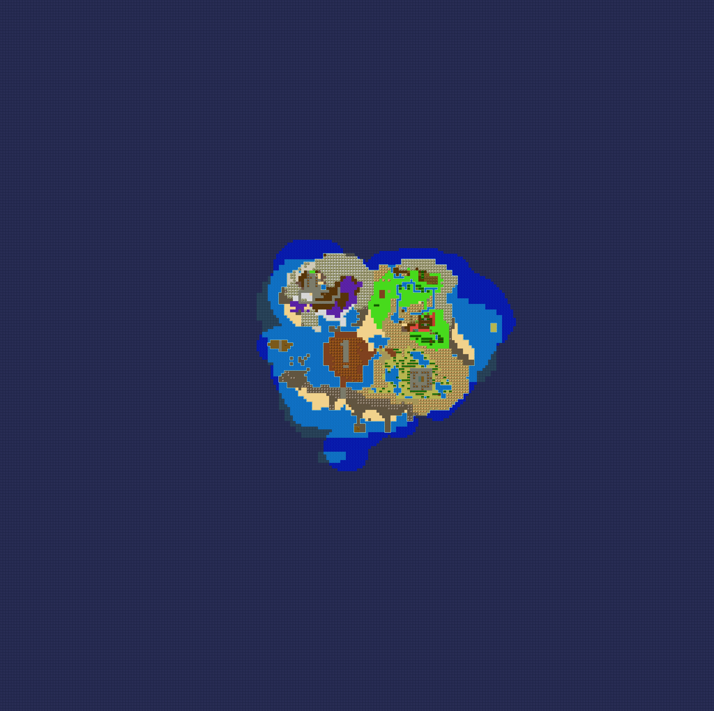

# DQB2MinimapExporter
Python program to export DQB2 Island Minimaps in high quality!

## Usage
By giving this program the file generated by [Turtle Insect's CMN.DAT export tool](https://github.com/turtle-insect/DQB2) it extracts the selected island's minimaps.

### - Hide unexplored tiles
- Unexplored tiles will be exported with the grid-like overlay the game HUD has. 
 
### - Hermit's Heresy mask
- Crops and resizes the image to fit the mask for [Hermit's Heresy power tools](https://github.com/default-kramer/HermitsHeresy) (only IoA is supported as of right now) 

## Important!!
- You can see the tile sheet of the program. As you can observe, its very much empty. If you use the exporter and some tile remains unmapped please do go to [issues](https://github.com/Sapphire645/DQB2MinimapExporter/issues) and send a screenshot of both the map and the generated image, that way I can add the tile to the sheet. In the meantime, since the default image leaves the background transparent you can overlay a screenshot to fill the gap.
- There are 2 minimap settings in-game. I might add support for the other tileset eventually.
- Angler's isle and Khrumbul-Dun's levels are not supported yet. If anyone wants them I'll add them

**Very spaguetti coded.**

