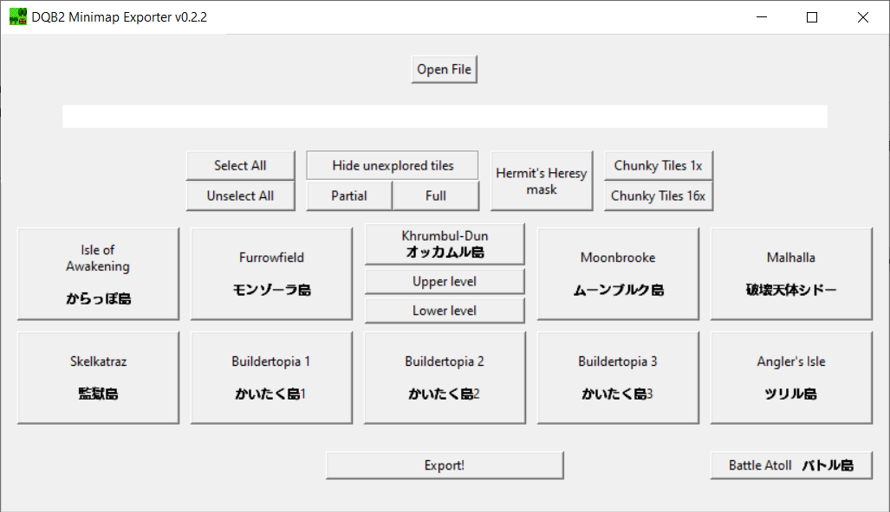

# DQB2MinimapExporter
Python program to export DQB2 Island Minimaps in high quality!

## Usage
By giving this program the file generated by [Turtle Insect's CMN.DAT export tool](https://github.com/turtle-insect/DQB2) it extracts the selected island's minimaps.

### - Hide unexplored tiles
- Unexplored tiles will be exported with the grid-like overlay the game HUD has. 
 
### - Hermit's Heresy mask
- Crops and resizes the image to fit the mask for [Hermit's Heresy power tools](https://github.com/default-kramer/HermitsHeresy) (only IoA is supported as of right now) 
### - Chunky Tiles
- Exports with the 'Chunky' tileset (avaliable in-game in the options menu) 
  - 1x makes each tile be 1x1 pixels.
  - 16x makes each tile be the same size as its retro equivalent

## Important!!
- You can see the tile sheets of the program. As you can observe, its very much empty. If you use the exporter and some tile remains unmapped please do go to [issues](https://github.com/Sapphire645/DQB2MinimapExporter/issues) and send a screenshot of both the map and the generated image, that way I can add the tile to the sheet. In the meantime, since the default image leaves the background transparent you can overlay a screenshot to fill the gap.
- The only missing minimap I know of is Battle Atoll. I'll add it eventually for fun even though it's not really accesible. Perhaps whenever I update it to be able to recognize if a minimap exists or not.

**Very spaguetti coded.**

